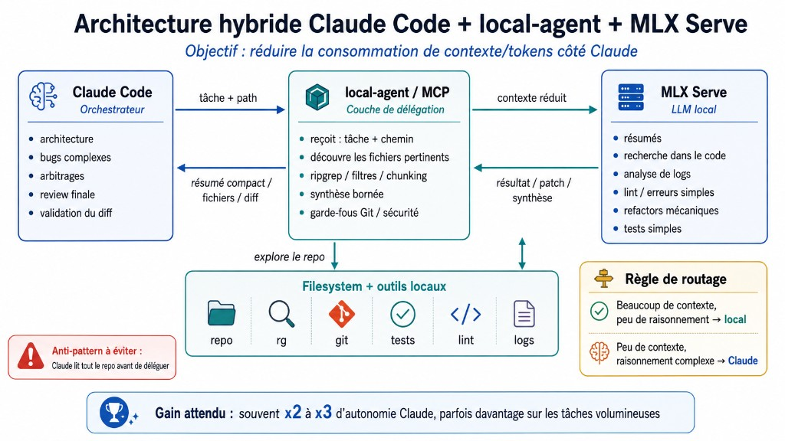

# local-agent

**Keep code, screenshots, logs and data local. Claude gets an evidence packet, not the raw document.**

Couche locale de réduction de contexte pour un agent de code (Claude Code, Cursor, tout client MCP).
L'orchestrateur envoie une intention et un chemin. Le brut reste sur la machine : `ripgrep`, git, OCR
Apple Vision, agrégats. Claude reçoit un paquet de preuves (500 à 3 000 tokens) avec des ids pour
demander le détail. Ce n'est pas un délégué LLM : le modèle local (mlx-serve) ne sert que le **code**.
Les captures passent par Vision, sans swap du 35B, sans VLM.

Règle : Claude ne reçoit jamais le document brut par défaut. D'abord un index avec des pointeurs,
ensuite un drill-down précis (`local_image_crop`, un fichier, un extrait).



## Ce que ça rapporte, mesuré

Pas un x2 magique. Le gain suit ce qui est intercepté **avant** d'entrer dans Claude.

| Type de session | Potentiel observé ou cible |
|---|---|
| Recette / anomalie, code seul (~12,5 % du contexte) | ~2 % d'une session de 18 M |
| Même session si les captures restent hors du préfixe | cible ~5–7 %, à mesurer |
| Exploration d'un module inconnu | ~8 % |
| Gros log / données | 10–30 %+ |
| Session surtout visuelle | dépend du crop, pas de l'OCR seul |

Banc de volume sur un dépôt Symfony réel de plus de 8 000 fichiers, contre la lecture manuelle
(détail dans `tests/bench.py`, latences sur un MoE 35B quantifié 4-bit) :

| Tâche | Contexte évité | Compression | Durée |
|---|---|---|---|
| Analyse d'un log de 1,3 Mo | ~324 000 tokens | 517x | 13 s |
| Recherche « comment le projet empêche-t-il X ? » | ~4 700 tokens | 14x | 0,9 s |
| Recherche traversant beaucoup de fichiers | ~6 400 tokens | 12x | 8,6 s |
| Synthèse d'un document de 10 Ko | ~2 500 tokens | 5,5x | 7,8 s |
| Revue d'un diff de 15 Ko | ~3 000 tokens | 5x | 11 s |
| Revue d'un petit répertoire | négatif (0,8x) | l'outil rend le brut | 9 s |
| Contrôle projet à sortie courte | négatif (0,9x) | l'outil rend le brut | 1 s |

Les deux dernières lignes sont le garde-fou de frugalité : quand la preuve brute est plus courte qu'une
synthèse, l'outil la renvoie telle quelle sans appeler le modèle, en disant pourquoi. Justesse mesurée
contre vérité terrain : 15/15 sur le dépôt client, 12/12 sur ce dépôt (`tests/bench_exactitude.py`).

## Installation

```bash
git clone https://github.com/TheBenBenJ/local-agent ~/.local-agent
~/.local-agent/install.sh
```

L'installateur enregistre le serveur MCP pour Claude Code (`~/.claude.json`) et Cursor
(`~/.cursor/mcp.json`) sans écraser une configuration existante. Redémarrer les clients, puis vérifier
avec l'outil `local_ping`.

## Prérequis

- Python 3.9+ (uniquement la bibliothèque standard, aucune dépendance à installer)
- `ripgrep` (`rg`)
- `git`
- un serveur local avec API compatible OpenAI : `mlx-serve`, Ollama, llama.cpp, LM Studio, vLLM…
- Docker uniquement pour les contrôles projet du preset Symfony (`phpstan`, `phpunit`…)

## Serveur local

Développé et mesuré contre `mlx-serve` (application MLX Core sur Apple Silicon), mais tout endpoint
compatible OpenAI convient via `LOCAL_LLM_BASE_URL` :

```bash
curl -s http://127.0.0.1:11234/v1/models | head -c 200
~/.local-agent/bin/local-agent ping
```

`LOCAL_LLM_MODEL=auto` sélectionne automatiquement le modèle déjà chargé côté serveur, il n'y a donc
rien à changer en cas de bascule de modèle.

### Choix du modèle

Banc comparatif sur les mêmes épreuves (dérivation de motifs, synthèses, JSON difficile), à code
identique :

| Modèle                               | Exactitude | Banc de 15 tours | Observation                                        |
| ------------------------------------ | ---------- | ---------------- | -------------------------------------------------- |
| Qwen3.6-35B-A3B 4-bit (20 Go)        | 15/15      | 43 s             | Motifs dérivés plus sélectifs, réponses plus courtes |
| Ornith-1.5-35B-A3B 4-bit (19,5 Go)   | 14/15      | 98 s             | Modèle « reasoning », plus lent, moins déterministe  |

Un modèle MoE non-reasoning d'environ 20 Go est le bon profil : les tâches du local-agent sont de la
synthèse encadrée, la réflexion préalable coûte des secondes sans gagner en justesse. Avec `mlx-serve`,
permuter se fait sans redémarrage : `POST /v1/unload-model` puis `POST /v1/load-model {"model": "..."}`.

## Language

MCP tool descriptions, report section titles (`Locations`, `Findings`, `Stats`) and savings footers
are in English, so any orchestrator can read the schema. The local model writes findings in the
**same language as the question or task**: a French query still gets a French answer. That behaviour
is covered by the accuracy bench. Absence and sampling guards stay bilingual so existing French
rules (`Ne pas conclure à l'absence`, `Réponse établie sur un échantillon`) keep matching.

## Emplacement et périmètre

Tout vit dans `~/.local-agent/`, hors des dépôts sur lesquels il travaille. La racine du dépôt à
analyser est déduite du répertoire courant via `git rev-parse --show-toplevel`, l'outil fonctionne donc
dans n'importe quel projet sans réglage, et `LOCAL_AGENT_REPO_ROOT` permet de la forcer.

## Utilisation depuis Claude Code ou Cursor

`install.sh` fait l'enregistrement. Pour le faire à la main, déclarer le serveur dans `~/.claude.json`
(Claude Code) ou `~/.cursor/mcp.json` (Cursor), clé `mcpServers.local-agent`, commande
`~/.local-agent/bin/local-agent-mcp`. Deux subtilités :

- **Cursor ne substitue pas** `${workspaceFolder}` : ne pas s'en servir. Pour viser un autre dépôt que
  celui détecté, passer son chemin absolu dans le paramètre `repo` de l'outil appelé.
- Les règles indiquant *quand* déléguer se placent dans la mémoire utilisateur du client
  (`~/.claude/CLAUDE.md` pour Claude Code, User Rules pour Cursor), ou se laissent porter par les
  descriptions des outils MCP qui contiennent déjà cette guidance.

Redémarrer le client après toute modification de ces fichiers.

| Outil MCP            | Rôle                                                        | Paramètres                                            |
| -------------------- | ----------------------------------------------------------- | ----------------------------------------------------- |
| `local_search`       | Localiser du code à partir d'une question                    | `query`, `path`, `globs`                               |
| `local_analyze`      | Analyse libre, résumé de fichiers, détection de doublons      | `path`, `task`, `mode`, `globs`, `max_files`           |
| `local_review`       | Première passe de revue de code                              | `path`, `task`, `globs`                                |
| `local_fix`          | Modification mécanique, transactionnelle par défaut           | `path`, `task`, `mode`, `patch_id`, `globs`, `allow_dirty` |
| `local_test_analysis`| Contrôle projet filtré et synthétisé                         | `kind`, `target`, `filter`                             |
| `local_log_analysis` | Analyse de logs volumineux                                   | `path`, `task`, `patterns`                             |
| `local_image`        | OCR d'une capture → paquet de preuves (Vision, pas de LLM)    | `path`, `paths`, `task`                                 |
| `local_image_crop`   | Crop d'une région (`a832-R1`), sans la capture complète       | `id`                                                    |
| `local_diff_review`  | Revue d'un diff git avec message de commit proposé            | `scope`, `base`, `task`                                |
| `local_ping`         | Diagnostic : connexion, racine, contrôles disponibles, config | aucun                                                  |

Tous les outils acceptent en plus un paramètre optionnel `repo`, chemin absolu du dépôt à analyser, qui
prime sur la racine configurée. `local_ping` affiche la racine effective et signale explicitement une
racine inutilisable.

### Modification transactionnelle

`local_fix` ne réécrit plus directement par défaut. `mode=propose` (défaut) génère les changements,
renvoie le diff unifié et un `patch_id`, sans rien écrire : la proposition est figée sur disque avec le
hash de chaque fichier source. `mode=apply` avec ce `patch_id` applique le contenu exact proposé, et
refuse tout fichier modifié entre-temps (proposition à refaire sur la version courante). Un bundle
appliqué est consommé, un bundle de plus de 7 jours est purgé. `mode=direct` garde l'ancien comportement
pour les changements triviaux.

### Observabilité

Chaque réponse MCP affiche quatre compteurs distincts :

1. **Raw context processed locally** : ce qui a été lu ici
2. **Claude-visible context returned** : ce qui part dans le paquet
3. **Direct context avoided** : la différence, one-shot
4. **Context exposure avoided** : ce one-shot × `LOCAL_AGENT_COMPOUND_TURNS` (défaut 25)

Le quatrième est une estimation d'exposition dans les tours suivants, **pas du billed**. Cache et
compaction du harness s'en mêlent. Mesuré : 14 339 one-shot → ~390 000 token-turns (~27×). Le même
appel vaut plus en début de session qu'à la fin. Cumuls dans `~/.local-agent/usage-totals.json`.

### Captures d'écran

`local_image` lit le fichier, rend le texte verbatim et des ids de régions. Un tableau (Excel,
DataTable) est reconstruit en grille à partir des boîtes, sans modèle : les lettres de colonnes
sont écartées, `#DIV/O!` redevient `#DIV/0!`. `local_image_crop` sort un PNG de la zone utile.
Pas de VLM. Un chemin absolu hors git est accepté.

## Utilisation en ligne de commande

```bash
~/.local-agent/bin/local-agent ping
~/.local-agent/bin/local-agent config

~/.local-agent/bin/local-agent search "où est implémentée l'authentification ?" --path src
~/.local-agent/bin/local-agent review src/Api/Service
~/.local-agent/bin/local-agent summarize src/Workflow --glob '*.php'
~/.local-agent/bin/local-agent duplicates src/Services/ContratTravail --glob '*.php'
~/.local-agent/bin/local-agent inspect src/Admin --task "liste les DataTable sans filtre de structure"

~/.local-agent/bin/local-agent logs var/log/symfony.log
~/.local-agent/bin/local-agent logs var/log --pattern 'CRITICAL' --pattern 'Uncaught'

# fix propose par défaut : diff + patch_id, rien n'est écrit
~/.local-agent/bin/local-agent fix src/Model --task "ajoute les docblocks @return manquants"
~/.local-agent/bin/local-agent apply a1b2c3d4e5f6   # applique la proposition exacte
~/.local-agent/bin/local-agent fix src/Model --task "..." --mode direct   # écriture immédiate

~/.local-agent/bin/local-agent check                 # premier contrôle disponible
~/.local-agent/bin/local-agent check phpstan --target src/Api
~/.local-agent/bin/local-agent check pytest --target tests

~/.local-agent/bin/local-agent diff              # tout le non committé (worktree)
~/.local-agent/bin/local-agent diff staged
~/.local-agent/bin/local-agent diff branch --base main

~/.local-agent/bin/local-agent image ~/Desktop/capture.png
~/.local-agent/bin/local-agent image ecran1.png ecran2.png ecran3.png --task "erreur"
~/.local-agent/bin/local-agent image-crop a832b1c4-R1
```

`--json` remplace le rendu markdown par le rapport JSON brut.

## Configuration

Par variables d'environnement, ou via un fichier `~/.local-agent/local-agent.env` (copier
`local-agent.env.example`, ignoré par git). L'environnement réel a toujours priorité sur le fichier.

| Variable                        | Défaut                       | Rôle                                                        |
| ------------------------------- | ---------------------------- | ----------------------------------------------------------- |
| `LOCAL_LLM_BASE_URL`            | `http://127.0.0.1:11234/v1`  | Racine de l'API compatible OpenAI                            |
| `LOCAL_LLM_MODEL`               | `auto`                       | `auto` prend le modèle déjà chargé                           |
| `LOCAL_LLM_API_KEY`             | vide                         | Jeton Bearer, uniquement si le serveur en exige un           |
| `LOCAL_LLM_TEMPERATURE`         | `0`                          | Température des requêtes                                     |
| `LOCAL_LLM_TIMEOUT`             | `300`                        | Timeout HTTP par requête, en secondes                        |
| `LOCAL_LLM_MAX_TOKENS`          | `1600`                       | Plafond de génération par requête                            |
| `LOCAL_AGENT_MAX_FILES`         | `40`                         | Fichiers analysés au maximum par appel                       |
| `LOCAL_AGENT_MAX_FILE_SIZE`     | `120000`                     | Octets lus au maximum par fichier                            |
| `LOCAL_AGENT_MAX_OUTPUT_TOKENS` | `900`                        | Plafond du rapport renvoyé à l'orchestrateur                 |
| `LOCAL_AGENT_CHUNK_CHARS`       | `12000`                      | Taille d'un lot envoyé au modèle local, premier levier de latence |
| `LOCAL_AGENT_MAX_CHUNKS`        | `8`                          | Lots au maximum par appel                                    |
| `LOCAL_AGENT_MAX_MATCHES`       | `200`                        | Correspondances ripgrep conservées                           |
| `LOCAL_AGENT_FIX_MAX_FILE_SIZE` | `40000`                      | Au-delà, un fichier n'est pas réécrit                        |
| `LOCAL_AGENT_COMMAND_TIMEOUT`   | `900`                        | Timeout des contrôles projet                                 |
| `LOCAL_AGENT_COMPOUND_TURNS`    | `25`                         | Facteur de tours restants pour l'effet facturé (one-shot × N) |
| `LOCAL_AGENT_REPO_ROOT`         | racine du dépôt              | Surcharge de la racine, utile pour les tests                  |

Les anciens noms `MLX_*` restent lus en rétrocompatibilité quand la variante `LOCAL_LLM_*` est absente.

## Contrôles projet par dépôt

`local_test_analysis` exécute les contrôles déclarés par le dépôt. Sans déclaration, un preset est
choisi selon le langage : Symfony (`phpstan`, `phpunit`, `cs-fixer`, `twig`, `yaml`, `eslint`, via
`docker compose exec`), Node (`test`, `lint`, `types`) ou Python (`pytest`, `ruff`, `mypy`). Pour
déclarer les siens, créer `.local-agent.json` à la racine du dépôt :

```json
{
  "checks": {
    "test": {"command": "npm test", "label": "Tests"},
    "types": {"command": ["npx", "tsc", "--noEmit"]},
    "lint": {"command": "npm run lint", "accepts_target": true}
  }
}
```

Ce fichier est une liste blanche : seules ces commandes déclarées sont exécutables, et `local_ping`
liste celles qui sont disponibles.

## Garde-fous

- **Confinement** : tout chemin est résolu et refusé s'il sort de la racine du dépôt. Exception :
  `local_image` accepte un fichier image absolu hors git (captures), refuse les secrets, `.ssh` et
  les fichiers de plus de 8 Mo.
- **Exclusions** : `.git`, `node_modules`, `vendor`, `var`, `temp`, `_db`, builds, caches, fichiers
  binaires. Un répertoire normalement exclu redevient lisible quand le chemin le désigne explicitement,
  ce qui permet d'analyser `var/log` sans ouvrir le reste de `var`.
- **`.gitignore`** : respecté par défaut, contourné seulement pour une cible explicitement ignorée.
- **Secrets** : `.env*`, `*.pem`, `*.key`, clés privées, `*credential*`, `*secret*`, dumps et sauvegardes
  ne sont jamais lus.
- **Écritures** : transactionnelles par défaut (proposition relue puis application exacte vérifiée par
  hash). Un fichier modifié mais non committé, ou non suivi par git, n'est jamais réécrit sans
  `allow_dirty`. Aucune commande destructrice n'est accessible, aucun `git reset`, aucune suppression de
  branche, aucun `git add` ni `git commit`.
- **Validation d'écriture** : écriture atomique, puis contrôle syntaxique quand disponible. Toute
  réécriture vide, identique, amputée de plus de moitié, plus que doublée ou ayant perdu son `<?php` est
  annulée et le contenu d'origine restauré.
- **Commandes** : seuls les contrôles en lecture déclarés par le preset ou `.local-agent.json` sont
  exposés. Le fichier est une liste blanche, pas un shell : aucune autre commande n'est atteignable.
- **Sortie bornée** : la lecture de la sortie de `rg` est plafonnée, et le rapport final est tronqué à
  `LOCAL_AGENT_MAX_OUTPUT_TOKENS`.

## Fonctionnement interne

```
local_agent/
├── config.py    variables d'environnement et bornes
├── mlx.py       client HTTP compatible OpenAI, résolution du modèle, nettoyage des blocs de raisonnement
├── files.py     découverte ripgrep, garde-fous, lecture bornée, découpage en lots
├── shell.py     exécution de commandes en liste blanche, état du working tree
├── prompts.py   consignes, contrats de sortie, extraction JSON tolérante aux troncatures
├── tasks.py     search, analyze, logs, check, diff_review
├── grid.py      reconstruction de tableau depuis les boîtes OCR, sans LLM
├── evidence.py  cache des paquets de preuves (ids, expiration 7 jours)
├── ocr.py       OCR et crop d'une capture (Vision / Tesseract, sans LLM)
├── ocr_vision.swift  binaire Vision compilé à la demande dans var/local-ocr
├── edit.py      propositions transactionnelles et réécriture sous contrôle git
├── report.py    rapport compact et clamp de sortie
├── cli.py       interface en ligne de commande
└── mcp.py       serveur MCP stdio (JSON-RPC 2.0, sans dépendance)
```

`search` procède en trois temps : le modèle local dérive des expressions ripgrep depuis la question,
`rg` exécute la recherche, puis le modèle ne raisonne que sur les correspondances et de courtes fenêtres
de code autour des fichiers les plus denses. `analyze` fait un map par lot suivi d'une réduction.
`logs` regroupe les lignes par signature normalisée et ne soumet que les signatures dominantes.

## Sonde de bon fonctionnement

```bash
python3 ~/.local-agent/tests/mcp_probe.py          # 7 appels réels, ~30 s
python3 ~/.local-agent/tests/mcp_probe.py --quick  # ping et recherche uniquement
```

La sonde lance le serveur en stdio, joue une série d'appels, vérifie que le confinement des chemins est
appliqué et qu'aucune réponse ne dépasse 4 000 caractères. Code de sortie non nul en cas d'échec.

## Bancs de mesure

```bash
python3 ~/.local-agent/tests/bench.py             # volume économisé par tâche, et latence
python3 ~/.local-agent/tests/bench_exactitude.py --tours 3   # justesse contre vérité terrain
```

Les cas vivent dans `tests/cases.json` et visent ce dépôt même, sans dépendance à un projet
particulier. Pour mesurer sur un dépôt de travail réel, copier ce fichier en `tests/cases.local.json`
(ignoré par git), l'adapter, puis :

```bash
LOCAL_AGENT_BENCH_REPO=/chemin/du/depot python3 tests/bench.py --cases tests/cases.local.json
```

Le banc d'exactitude note par mots clés, ce qui est un proxy : il attrape les échecs francs, pas les
nuances. Ses `interdits` doivent rester des formulations sans équivoque, une phrase trop générale
produisant de faux négatifs.

### Latence

```bash
python3 ~/.local-agent/tests/bench_latence.py --tours 3
```

Un appel qui atteint le modèle coûte 4 à 10 secondes sur un 35B quantifié ; un appel tranché par
l'arbitrage de frugalité coûte moins d'une seconde. La décomposition par phase montre où passe le temps :

| Phase | Part |
|---|---|
| Synthèse par le modèle | 87 % |
| Dérivation des motifs | 12 % |
| ripgrep et extraction des fenêtres | moins de 1 % |

Le travail sur disque est donc gratuit, et **le coût suit la taille de l'entrée, pas celle de la
sortie** : abréger le rapport ne gagne que 0,5 s, tandis que passer le budget d'extraits de 48 000 à
12 000 caractères fait tomber la synthèse de 8,3 s à 6,6 s. C'est le réglage à toucher en premier,
`LOCAL_AGENT_CHUNK_CHARS`, en gardant à l'esprit qu'un budget trop étroit finit par priver le modèle du
contexte qui porte la réponse.

Attention en mesurant : `mlx-serve` garde un cache de prompt, donc rejouer deux fois la même requête
donne un temps trompeusement bas. Ne comparer que des requêtes distinctes.

## Limites connues

- Un appel qui atteint le modèle coûte 5 à 10 secondes, une analyse au plafond des 8 lots environ une
  minute : c'est un outil de tâches de fond, pas d'allers-retours interactifs.
- **La recherche dépend du pont lexical entre la question et les identifiants du code.** Plusieurs
  mécanismes le construisent (traduction des notions, adaptation au langage dominant du dépôt, radicaux
  des identifiants proposés, seconde dérivation quand la moisson est maigre), mais une question purement
  descriptive sans aucun terme du code peut encore échouer. Nommer le symbole quand on le connaît, ou
  resserrer le `path` et les `globs`.
- `local_fix` fait réécrire le fichier entier par le modèle, même en mode transactionnel : réservé aux
  fichiers de moins de 40 000 caractères et aux consignes réellement mécaniques.
- Le contrôle syntaxique après écriture n'existe que pour PHP (`php -l`, qui suppose Docker démarré sur
  le preset Symfony). Pour les autres langages, seule la vraisemblance du contenu est vérifiée.
